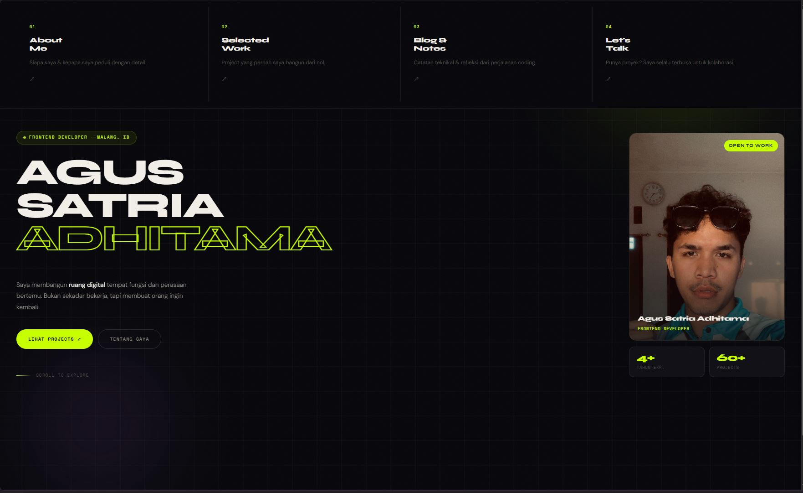

# Agus Satria Adhitama - Portfolio & Blog

> *"Saya membangun ruang digital - tempat fungsi dan perasaan bertemu."*

Personal portfolio dan blog milik **Agus Satria Adhitama**, seorang Frontend Developer yang berbasis di Malang, Indonesia. Dibangun tanpa framework murni HTML, CSS, dan JavaScript.

---

## ✨ Preview



🔗 **Live:** [KLIK DISINI OM](https://agusadhitama.github.io/agus-satria-adhitama-web)

---

## 📁 Struktur Project

```
agus-satria-portfolio/
├── index.html        → Homepage hero, navigasi utama
├── about.html        → Tentang saya, experience, skills
├── projects.html     → Daftar project + filter kategori
├── blog.html         → Artikel blog + filter + newsletter
├── contact.html      → Form kontak + social links + availability
├── style.css         → Shared design system & typography
├── main.js           → Loader, scroll reveal, ripple effect
├── photo.jpeg        → Foto profil
└── README.md         → You are here
```

---

## 🚀 Fitur

- **Multi-page** 5 halaman terpisah yang saling terhubung
- **Dark theme** Desain editorial gelap dengan aksen lime green
- **Scroll reveal** Elemen muncul animasi saat di-scroll
- **Filter interaktif** Projects & blog bisa difilter by kategori
- **Ripple effect** Semua elemen clickable punya feedback visual
- **Subtle tilt** Card foto bergerak mengikuti kursor
- **Marquee** Teks berjalan otomatis di setiap halaman
- **Loader screen** Animasi loading saat pertama buka
- **Contact form** Form pesan dengan validasi sederhana
- **Newsletter form** Subscribe form di halaman blog
- **Fully responsive** Mobile & desktop friendly
- **Zero dependency** Tidak ada npm, tidak ada framework

---

## 🛠️ Tech Stack

| Layer      | Tech                        |
|------------|-----------------------------|
| Markup     | HTML5 (semantic)            |
| Styling    | CSS3 (custom properties, grid, flexbox, animations) |
| Logic      | Vanilla JavaScript (ES6+)   |
| Fonts      | Google Fonts Syne, DM Sans, Space Mono |
| Deploy     | GitHub Pages                |
| Editor     | VS Code + Live Server       |

---

## ⚡ Cara Pakai

### 1. Clone repo

```bash
git clone https://github.com/agusadhitama/agus-satria-adhitama-web.git
cd portfolio
```

### 2. Buka di browser

Cukup buka `index.html` langsung di browser, atau gunakan Live Server di VS Code:

```
Klik kanan index.html → Open with Live Server
```
---

## 🎨 Kustomisasi Warna

Semua warna ada di `style.css` bagian `:root`. Ubah sesuai selera:

```css
:root {
  --bg:     #07070a;   /* background utama */
  --bg2:    #0f0f14;   /* background sekunder */
  --ink:    #f2eee8;   /* teks utama */
  --ink2:   #9b9690;   /* teks sekunder */
  --lime:   #c8ff00;   /* warna aksen utama ← ganti ini untuk ubah vibe */
}
```

Contoh warna aksen alternatif:
- 🔵 Biru electric: `#00d4ff`
- 🟠 Orange: `#ff7a2f`
- 🟣 Purple: `#b06bff`
- 🩷 Pink: `#ff6b9d`

---

## 📄 Lisensi

Kode ini bebas digunakan untuk keperluan pribadi dan portfolio.
Jangan lupa kasih credit kalau kamu pakai sebagai template ya 🙏

---

<div align="center">

**Dibuat dengan ☕ dan terlalu banyak tab browser**

*Agus Satria Adhitama - Malang, Indonesia*

[](https://github.com/agussatria)
[](https://linkedin.com/in/agussatria)

> *"You don't need a framework to build something fast."*

</div>
